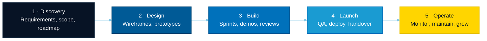
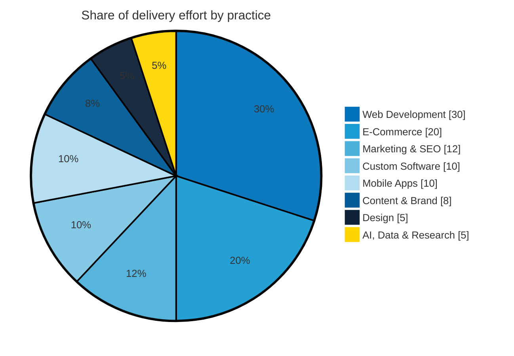

<!--
  ███╗   ███╗██╗ ██████╗██████╗  ██████╗ ██████╗ ███████╗███████╗████████╗
  ████╗ ████║██║██╔════╝██╔══██╗██╔═══██╗██╔══██╗██╔════╝██╔════╝╚══██╔══╝
  ██╔████╔██║██║██║     ██████╔╝██║   ██║██║  ██║█████╗  █████╗     ██║
  ██║╚██╔╝██║██║██║     ██╔══██╗██║   ██║██║  ██║██╔══╝  ██╔══╝     ██║
  ██║ ╚═╝ ██║██║╚██████╗██║  ██║╚██████╔╝██████╔╝███████╗██║        ██║
  ╚═╝     ╚═╝╚═╝ ╚═════╝╚═╝  ╚═╝ ╚═════╝ ╚═════╝ ╚══════╝╚═╝        ╚═╝

  Brand system — sourced from microdeft.com CSS custom properties:
    primary  #0071BB   ·  navy #071325  ·  accent #FFD500
    typeface DM Sans   ·  established 2015, Dhaka, Bangladesh
-->

<!-- ──────────────────────────  WORDMARK  ────────────────────────── -->

<a href="https://microdeft.com">
  <picture>
    <source media="(prefers-color-scheme: dark)"  srcset="https://microdeft.com/images/microdeft-logo-white.avif" />
    <source media="(prefers-color-scheme: light)" srcset="https://microdeft.com/images/microdeft-logo.png" />
    
  </picture>
</a>

  

<!-- ────────────────────────  ANIMATED TAGLINE  ──────────────────────── -->

 

<!-- ───────────────────────────  FACT BADGES  ─────────────────────────── -->

 

 

## Who We Are

<table>
<tr>
<td width="62%" valign="top">

**Microdeft is a software engineering and digital growth firm based in Dhaka, Bangladesh.** Since **2015** we have designed, built and operated custom web applications, mobile products, e-commerce platforms and AI systems for startups and enterprises across **75+ countries**.

We work as an extension of the teams we join — not as a ticket queue. Product managers, engineers and designers sit on the same team as yours, and you see working software every sprint.

Our practice began with a single conviction that still governs every engagement: *technology, applied with discipline, is what changes a company's trajectory.*

</td>
<td width="38%" valign="top">

**What we optimise for**

- Scaled, revenue-generating products
- Architecture that survives growth
- Security and compliance by default
- Measurable outcomes, not vanity metrics

**How we engage**

- Dedicated teams & fixed-scope buildouts
- Transparent pricing, no hidden cost
- Fixed-price and hourly models

</td>
</tr>
</table>

 

## By the Numbers

| 🏆 **7,000+** | 🚀 **10,000+** | 🛒 **6,000+** | ⏳ **11+** |
| :---: | :---: | :---: | :---: |
| Clients served | Projects delivered | E-commerce stores | Years building |

| 🏭 **18+** | 🌍 **75+** | 👥 **50–249** | ⭐ **5.0 / 5.0** |
| :---: | :---: | :---: | :---: |
| Industries served | Countries reached | People on team | Verified client rating |

 

## What We Build

| Service | Scope |
| :--- | :--- |
| **[Web Development](https://microdeft.com/web-development)** | Custom websites and web applications, SaaS dashboards, headless CMS and WordPress, UI/UX, e-commerce storefronts, Core Web Vitals performance work |
| **[App Development](https://microdeft.com/app-development)** | Native Android (Kotlin/Java) and iOS (Swift/SwiftUI), cross-platform Flutter and React Native, mobile games, Shopify apps, store submission support |
| **[Software Development](https://microdeft.com/software-development)** | Bespoke systems, multi-tenant SaaS, ERP and CRM, LMS, BPM, HRM, IoT platforms, and AI-embedded software |
| **[AI Services](https://microdeft.com/ai-services)** | AI applications and integrations, chatbots, autonomous agents, LLM fine-tuning, data science and ML, generative art, AI video and voice synthesis |
| **[Digital Marketing](https://microdeft.com/digital-marketing)** | SEO and local SEO, SEM and PPC, social media and performance marketing, email and SMS, influencer work, analytics and CRO |
| **[Graphic Design](https://microdeft.com/graphic-design)** | Brand identity and logo systems, UI/UX, packaging, motion graphics, illustration and infographics, 3D and game art — 49+ design services |
| **[Business Services](https://microdeft.com/business)** | Company formation and consulting, market research, legal and IP, HR and virtual assistants, product management, lead generation, GTM engineering |
| **[Content & Finance](https://microdeft.com/others)** | Long-form and blog writing, ad and sales copy, UX writing, press, content strategy, fractional CFO, bookkeeping and payroll |

 

## Technology

**Engineering**

**Frontend**

**Mobile**

**Commerce & CMS**

**Data, Cloud & Delivery**

**AI & Design**

 

## How We Work

 

| | Principle | In practice |
| :-- | :--- | :--- |
| 🔒 | **Security by default** | OWASP practice, end-to-end encryption and regular audit — not a late-stage checklist |
| ⚡ | **Rapid time-to-market** | Agile sprints behind CI/CD pipelines; MVPs ship in weeks, not quarters |
| 🧾 | **Transparent commercials** | Fixed-price and hourly models with written proposals. No hidden line items |
| 👥 | **Dedicated teams** | Engineers, designers and PMs who stay with your product after launch |
| 🛠️ | **Long-term operation** | Maintenance and monitoring so the system stays fast, patched and current |
| 🌍 | **Global delivery** | 75+ countries served with time-zone-aligned communication |

 

## Industries

`E-Commerce` · `Fashion & Apparel` · `Real Estate` · `SaaS` · `Business Services` · `Startups` · `Logistics` · `Legal` · `Sports & Fitness` · `Gaming` · `Health & Fitness` · `Automotive` · `Photo & Video` · `AR/VR` · `Non-Profit` · `Finance & Banking` · `Telecom` · `Energy & Utilities`

 

## Delivery Profile

<table>
<tr>
<td width="50%" valign="top">

**Client profile**

| Segment | Share |
| :--- | :---: |
| Small business (< $10M) | **80%** |
| Mid-market ($10M – $1B) | **15%** |
| Enterprise (> $1B) | **5%** |

</td>
<td width="50%" valign="top">

**Industry concentration**

| Industry | Share |
| :--- | :---: |
| E-Commerce | **30%** |
| Startups | **25%** |
| Education | **10%** |
| Healthcare | **10%** |
| Fintech · Gaming · Business services · Real estate · Entertainment | **25%** |

</td>
</tr>
</table>

 

## Work With Us

### Bring us the problem. We'll bring the architecture, the team and the shipping cadence.

**Free consultation with a scoped proposal, a realistic timeline and transparent pricing — no obligation.**

 

| | |
| :--- | :--- |
| **Office** | House 14, Block B, Banasree, Dhaka 1219, Bangladesh |
| **Phone** | [+1 979-366-3366](tel:+19793663366) · [+880 9638-009005](tel:+8809638009005) |
| **Email** | [info@microdeft.com](mailto:info@microdeft.com) — we reply within 24 hours |
| **Web** | [microdeft.com](https://microdeft.com) |

 

If our open-source work is useful to you, a ⭐ helps other developers find it.

 

© 2026 <strong>Microdeft</strong> — software engineering & digital growth, Dhaka, Bangladesh. Established 2015.

